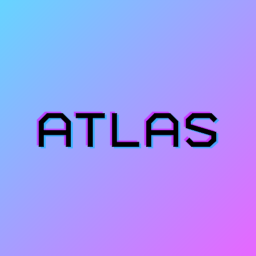
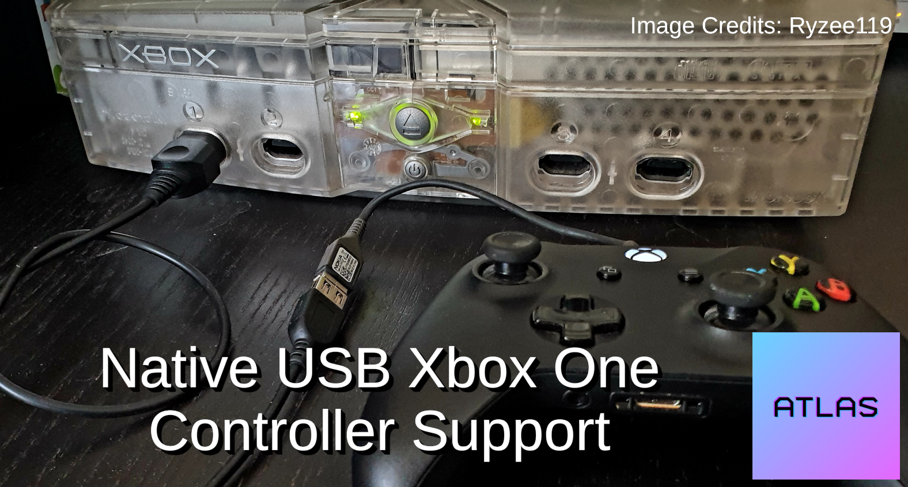

# Project Atlas

 
 
 
 

> atlas (noun) - a book containing maps showing where particular things are made, found, etc.:.

The goal of Project Atlas is to be a comprehensive framework for reverse engineering, documenting, and extending the original Microsoft Xbox software library via static analytics.

## About
What started off as simple research and toolchain development for our XboxHD+ has quickly developed into much more. Project Atlas aims to take the years of research and development from that project and incorporated it into an easy-to-use framework for documentation, analysis, and extending software on the original Xbox.

At the core of Project Atlas is a set of tools for static analysis and on top of that is a set of build tools for injecting native C code directly into XBEs.

## Proof of Concept

The first proof-of-concept that we're releasing is adding additional USB controller support to games, in this case, the original release of Halo. 

Adding additional \"drivers\" in the past has always been labeled as impossible. The USB stack and all of its drivers are builtin directly into every game. But with Project Atlas, we can use static analytics to automatically perform ahead-of-time full abstraction out every function, member, struct, datatype, etc of the USB system to quickly and easily implement in support for more controllers.

### Requirements:
- Original release of Halo. Halo - Combat Evolved (USA)
- <a href="https://makemhz.com/products/xbox-usb-adapter" target="_blank">Xbox USB Adapter</a> or simular.
- <a href="https://github.com/MakeMHz/project-atlas/blob/main/media/halo_patch.bps">BPS Patch</a>

### Limitations
- Only works with Xbox One series of controllers (Micro-USB, no share button). Support for XSX and Elite controllers has not be added yet.
- Only tested with first-party OEM controllers and the Hyperkin Duke.
- Some controllers may not report button presses unless a change in joystick/trigger movement is also detected.
- This is strickly a proof-of-concecpt.

## Licensing
Project Atlas is free and open source. Please respect the licenses available in their respective folders.
